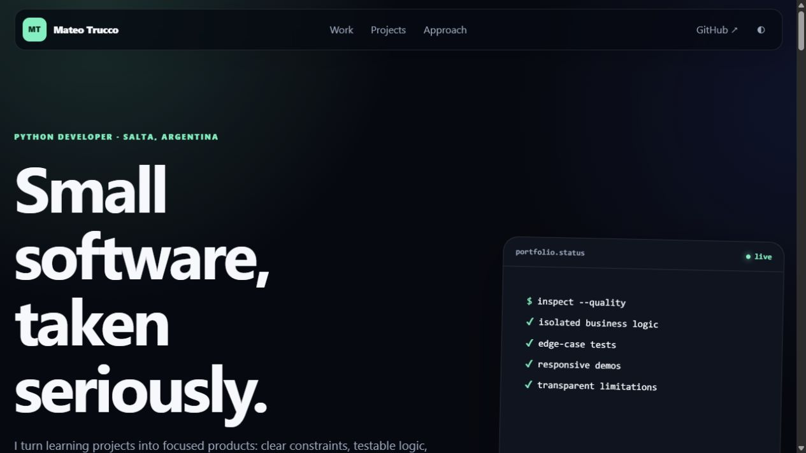

# Mateo Trucco — Portfolio

A dependency-free portfolio that presents fifteen small software projects as a coherent body of work: clear problem framing, testable logic, useful failure states and runnable experiences.

[](https://mateotrucco.github.io/)

**[Visit the portfolio](https://mateotrucco.github.io/)** · [Browse the GitHub profile](https://github.com/MateoTrucco)

## Experience

- Six selected projects with larger editorial cards
- Searchable and filterable index for all fifteen repositories
- Project-specific screenshots with graceful visual fallbacks
- Persistent light/dark theme and reduced-motion support
- Responsive layout with skip navigation and semantic landmarks
- Central project metadata in `static/js/projects.js`

## Live-project strategy

- Native HTML/CSS/JavaScript projects run directly.
- Pure Python logic runs in the browser through versioned Pyodide **314.0.4**.
- OS-bound projects use transparent sample datasets because a browser cannot read host processes, Registry keys or Windows shortcuts.
- The Django project exposes its main workflow as an interactive simulator; the real authenticated backend remains in its repository.

## Local development

Serve the workspace from its parent directory so project links resolve exactly as they do on GitHub Pages:

```bash
python -m http.server 8000
```

Then open `http://localhost:8000/mateotrucco.github.io/`.

```bash
npm test
```

Node **24.x** is pinned through `.nvmrc`, `package.json` and GitHub Actions.
